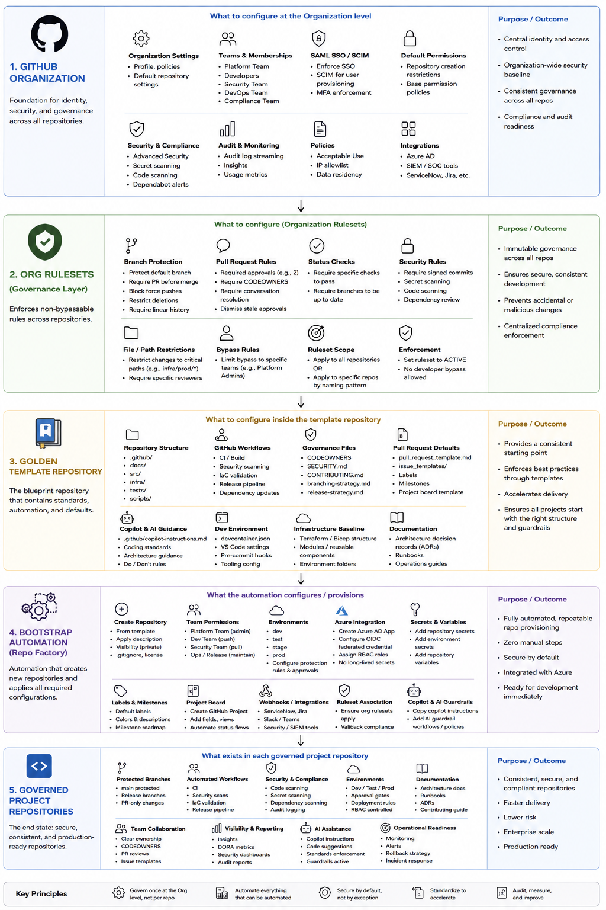
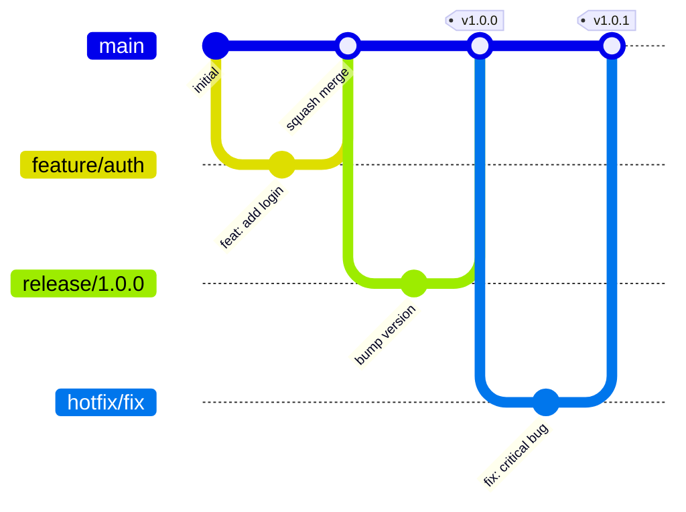

# Enterprise Repository Template

A **golden repository template** for creating fully governed, enterprise-grade repositories with built-in CI/CD, security scanning, branching conventions, and infrastructure scaffolding.

> Click **"Use this template"** to create a new repository with all governance, automation, and best practices pre-configured.

---

## Enterprise Governance Architecture

This template implements **Layer 3** of a 5-layer enterprise governance model:



| Layer | Component | Purpose |
|-------|-----------|---------|
| 1 | **GitHub Organization** | Foundation for identity, security, and governance across all repositories |
| 2 | **Org Rulesets** | Immutable governance enforcement (branch protection, status checks, security rules) |
| 3 | **Golden Template Repository** | ← *This repo* — the blueprint with standards, automation, and defaults |
| 4 | **Bootstrap Automation** | Repo factory that provisions teams, environments, secrets, and integrations |
| 5 | **Governed Project Repositories** | The end state — secure, consistent, production-ready repositories |

---

## What's Included

| Category | Contents |
|----------|----------|
| **CI/CD** | GitHub Actions for build, test, lint, deploy (staging + production with approvals) |
| **Security** | CodeQL scanning, Dependabot, dependency review, secret scanning, TruffleHog |
| **IaC Guardrails** | Terraform fmt/validate/tflint + Bicep build/lint + Checkov security scanning |
| **Azure OIDC** | Automated federated credential setup for passwordless GitHub → Azure auth |
| **Branching** | Trunk-based strategy with `main`, `release/*`, `feature/*`, `hotfix/*` |
| **Templates** | PR template, bug report, feature request issue forms |
| **Governance** | CODEOWNERS, SECURITY.md, CONTRIBUTING.md, conventional commits |
| **Infrastructure** | Terraform + Bicep scaffolding with multi-environment support |
| **Dev Environment** | Dev Container / Codespaces configuration |
| **Releases** | Semantic versioning workflow with automated changelogs |
| **Labels** | Automated label sync from configuration file |
| **ADRs** | Architecture Decision Records with template |
| **AI Coding** | GitHub Copilot instructions and guardrails |
| **Automation** | Repository bootstrap workflow for team-specific setup |

---

## Repository Structure

```
├── .devcontainer/              # Dev Container / Codespaces configuration
│   └── devcontainer.json
├── .github/
│   ├── CODEOWNERS              # Automatic PR review assignment
│   ├── PULL_REQUEST_TEMPLATE.md
│   ├── copilot-instructions.md # AI coding guardrails
│   ├── dependabot.yml          # Automated dependency updates
│   ├── labels.yml              # Repository label definitions
│   ├── ISSUE_TEMPLATE/
│   │   ├── bug_report.yml
│   │   ├── feature_request.yml
│   │   └── config.yml
│   └── workflows/
│       ├── ci.yml              # Continuous Integration
│       ├── cd.yml              # Continuous Deployment
│       ├── codeql.yml          # Security scanning (manual trigger)
│       ├── iac-guardrails.yml  # Terraform + Bicep validation
│       ├── azure-oidc-setup.yml # Azure federated credential setup
│       ├── release.yml         # Semantic versioning releases
│       ├── label-sync.yml      # Label automation
│       ├── stale.yml           # Stale issue/PR cleanup
│       └── repo-bootstrap.yml  # New repo setup automation
├── .vscode/
│   ├── extensions.json         # Recommended extensions
│   └── settings.json           # Workspace settings
├── docs/
│   ├── branching-strategy.md   # Branching conventions
│   └── adr/                    # Architecture Decision Records
│       ├── README.md
│       ├── template.md
│       └── 001-use-adr-for-decisions.md
├── infra/
│   ├── README.md
│   ├── terraform/              # Terraform IaC
│   │   ├── main.tf
│   │   ├── outputs.tf
│   │   ├── .tflint.hcl         # TFLint configuration
│   │   └── environments/
│   │       ├── dev.tfvars
│   │       ├── staging.tfvars
│   │       └── production.tfvars
│   └── bicep/                  # Azure Bicep IaC
│       ├── main.bicep
│       └── bicepconfig.json    # Bicep linting rules
├── src/                        # Application source code
├── tests/
│   ├── unit/
│   ├── integration/
│   └── e2e/
├── .gitignore
├── CONTRIBUTING.md
├── LICENSE
├── SECURITY.md
└── README.md
```

---

## Quick Start

### 1. Create a Repository from This Template

Click **"Use this template"** → **"Create a new repository"** in GitHub.

### 2. Run the Bootstrap Workflow

After creating your repo, run the **Repository Bootstrap** workflow:

1. Go to **Actions** → **Repository Bootstrap**
2. Click **"Run workflow"**
3. Enter your team name, project name, and primary language
4. The workflow configures CODEOWNERS, creates initial issues and milestones

### 3. Set Up Azure OIDC (Optional)

For passwordless Azure deployments, run the **Azure OIDC Setup** workflow:

1. Go to **Actions** → **Azure OIDC Setup**
2. Click **"Run workflow"**
3. Enter your Azure Subscription ID and (optionally) a resource group
4. The workflow creates an App Registration, federated credentials, and sets repository variables

This eliminates the need for storing Azure client secrets in GitHub.

### 4. Configure Branch Protection

Apply these branch protection rules to `main`:

```bash
# Using GitHub CLI
gh api repos/{owner}/{repo}/rulesets --method POST --input .github/rulesets/main.json
```

Or configure manually in **Settings** → **Branches** → **Branch protection rules**:

- ✅ Require pull request before merging (2 approvals)
- ✅ Dismiss stale pull request approvals
- ✅ Require status checks to pass (CI Pipeline)
- ✅ Require branches to be up to date
- ✅ Require signed commits (recommended)
- ❌ Allow force pushes
- ❌ Allow deletions

### 5. Configure Environments

Set up deployment environments in **Settings** → **Environments**:

| Environment | Protection Rules |
|-------------|-----------------|
| `staging` | Required reviewers (1) |
| `production` | Required reviewers (2), wait timer (5 min) |

### 6. Add Secrets and Variables

Configure these in **Settings** → **Secrets and variables** → **Actions**:

| Secret/Variable | Purpose |
|----------------|---------|
| `AZURE_CLIENT_ID` | Azure OIDC authentication |
| `AZURE_TENANT_ID` | Azure tenant |
| `AZURE_SUBSCRIPTION_ID` | Azure subscription |
| `STAGING_URL` | Staging environment URL (variable) |
| `PRODUCTION_URL` | Production environment URL (variable) |

---

## Branching Strategy



| Branch | Purpose | Lifetime |
|--------|---------|----------|
| `main` | Production-ready, always deployable | Permanent |
| `release/*` | Release stabilization | Days |
| `feature/*` | New features | 1-3 days |
| `hotfix/*` | Critical production fixes | Hours |

See [docs/branching-strategy.md](docs/branching-strategy.md) for full details.

---

## Governance Enforcement

### Organization-Level (GitHub Enterprise)

For non-optional governance across all repos:

1. **Organization Rulesets**: Enforce branch protection across all repositories
2. **Required Workflows**: Mandate security scanning for all repos
3. **Custom Properties**: Tag repos by team, compliance level, etc.
4. **Template Restrictions**: Only allow repo creation from approved templates

### Repository-Level

| Control | Mechanism |
|---------|-----------|
| Code review | CODEOWNERS + required approvals |
| Code quality | CI pipeline (lint, test, build) |
| Security | CodeQL + Dependabot + TruffleHog + dependency review |
| IaC guardrails | Terraform validate/tflint + Bicep lint + Checkov |
| Azure auth | OIDC federated credentials (no stored secrets) |
| Commit format | Conventional commits (enforced via CI) |
| Dependencies | Dependabot + vulnerability alerts |
| Stale cleanup | Automated stale issue/PR management |

---

## Customization Guide

### Adding Your Application Code

1. Add your source code to `src/`
2. Add tests to `tests/unit/`, `tests/integration/`, `tests/e2e/`
3. Update the CI workflow (`.github/workflows/ci.yml`) with your build/test commands
4. Update `.github/dependabot.yml` to enable your package ecosystem

### Choosing IaC

- **Azure only**: Use `infra/bicep/` — remove `infra/terraform/`
- **Multi-cloud**: Use `infra/terraform/` — remove `infra/bicep/`
- **Both**: Keep both directories

### Updating CODEOWNERS

Edit `.github/CODEOWNERS` to reflect your team structure. Replace `@org/team-name` with your actual GitHub organization and team slugs.

### Configuring CodeQL Languages

Edit `.github/workflows/codeql.yml` and update the language matrix:

```yaml
language: ['javascript', 'python']  # Add your languages
```

---

## Automation Beyond This Template

For full enterprise automation, consider:

```bash
# Terraform GitHub Provider - manage repos as code
terraform {
  required_providers {
    github = {
      source = "integrations/github"
    }
  }
}

# Create repo from template
resource "github_repository" "new_service" {
  name        = "my-new-service"
  template {
    owner      = "my-org"
    repository = "enterprise-repo-template"
  }
}
```

### GitHub CLI Automation

```bash
# Create repo from template
gh repo create my-org/new-service --template my-org/enterprise-repo-template --private

# Apply branch protection
gh api repos/my-org/new-service/branches/main/protection --method PUT \
  --field required_pull_request_reviews='{"required_approving_review_count":2}'

# Add team permissions
gh api orgs/my-org/teams/backend-team/repos/my-org/new-service --method PUT \
  --field permission=push
```

---

## Contributing

See [CONTRIBUTING.md](CONTRIBUTING.md) for development workflow, commit conventions, and PR guidelines.

## Security

See [SECURITY.md](SECURITY.md) for vulnerability reporting procedures.

## License

MIT - See [LICENSE](LICENSE) file for details.
