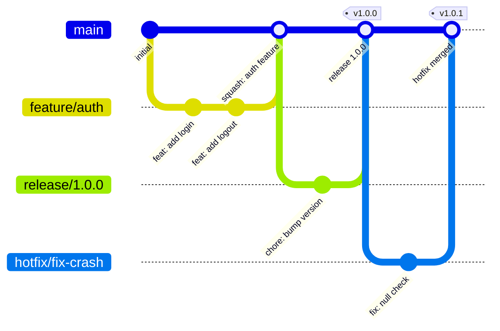

# Branching Strategy

## Overview

This repository follows a **trunk-based development** strategy with short-lived feature branches and release branches for production deployments.

## Branch Types

```
main                    ← Always deployable, protected
├── release/1.0.0       ← Release preparation & stabilization
├── feature/ABC-123     ← New features (short-lived, < 2 days ideal)
└── hotfix/ABC-456      ← Critical production fixes
```

### `main` Branch

- **Purpose**: Production-ready code, single source of truth
- **Protection**: Required reviews, status checks, no force push
- **Deploys to**: Staging (automatically on merge)

### `release/*` Branches

- **Purpose**: Release stabilization and preparation
- **Created from**: `main`
- **Naming**: `release/X.Y.Z` (semantic version)
- **Merges to**: `main` (via PR) + tag created
- **Deploys to**: Production (on tag)
- **Lifetime**: Days (until release is shipped)

### `feature/*` Branches

- **Purpose**: New features and non-critical changes
- **Created from**: `main`
- **Naming**: `feature/<ticket-id>-short-description`
- **Merges to**: `main` (via PR)
- **Lifetime**: 1-3 days ideal, max 5 days

### `hotfix/*` Branches

- **Purpose**: Critical production fixes
- **Created from**: Latest release tag or `main`
- **Naming**: `hotfix/<ticket-id>-short-description`
- **Merges to**: `main` (via PR)
- **Lifetime**: Hours to 1 day

## Workflow

### Feature Development

```bash
# 1. Create feature branch
git checkout main && git pull
git checkout -b feature/ABC-123-add-user-auth

# 2. Make commits (conventional commits)
git commit -m "feat(auth): add OAuth2 login flow"

# 3. Push and create PR
git push -u origin feature/ABC-123-add-user-auth
gh pr create --base main

# 4. After approval and CI passes → Squash merge to main
```

### Release Process

```bash
# 1. Create release branch
git checkout main && git pull
git checkout -b release/1.2.0

# 2. Version bumps, final fixes only
git commit -m "chore(release): bump version to 1.2.0"

# 3. PR to main, merge, then tag
gh pr create --base main
# After merge:
git tag v1.2.0
git push origin v1.2.0
```

### Hotfix Process

```bash
# 1. Create hotfix from main
git checkout main && git pull
git checkout -b hotfix/ABC-456-fix-auth-crash

# 2. Fix and commit
git commit -m "fix(auth): prevent null pointer in token refresh"

# 3. PR to main (expedited review)
gh pr create --base main --label "priority: critical"
```

## Branch Protection Rules

### `main` Branch

| Rule | Setting |
|------|---------|
| Require pull request | Yes |
| Required approvals | 2 |
| Dismiss stale reviews | Yes |
| Require status checks | CI Pipeline, Security Scan |
| Require branches up to date | Yes |
| Require signed commits | Recommended |
| Allow force push | No |
| Allow deletion | No |

### `release/*` Branches

| Rule | Setting |
|------|---------|
| Require pull request | Yes |
| Required approvals | 1 |
| Require status checks | CI Pipeline |
| Allow force push | No |

## Merge Strategy

- **Feature → main**: Squash merge (clean history)
- **Release → main**: Merge commit (preserve release history)
- **Hotfix → main**: Squash merge

## Diagram


